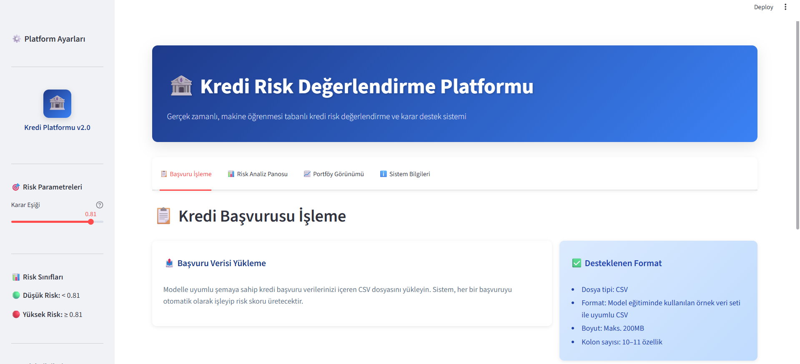

# KREDİ RİSK SKORLAMA MODELİ (End-to-End ML Projesi)

Bankacılık sektöründe kredi başvurularının geri ödeme (*default*) riskini tahmin etmek için hazırlanmış uçtan uca bir **makine öğrenmesi projesi**.

Proje; veri keşfinden (EDA), veri temizleme ve feature engineering adımlarına, baseline modellerden XGBoost optimizasyonuna, threshold seçiminden SHAP ile açıklanabilirliğe ve en sonunda **FastAPI + Streamlit** ile deployment’a kadar tüm süreci kapsar.

## Problem Tanımı

**Amaç:**  
Bir müşterinin, önümüzdeki **2 yıl içinde ciddi finansal gecikme (serious delinquency) yaşama olasılığını** tahmin etmek.

- **Hedef değişken:** `SeriousDlqin2yrs`  
  - `0` → 2 yıl içinde ciddi finansal gecikme yok  
  - `1` → 2 yıl içinde ciddi finansal gecikme var  

Bankacılık tarafında bu metrik, pratikte *default riski için güçlü bir temsilci değişken* olarak kullanılır; model de iş açısından “kredi geri ödememe riski”ni yönetmek için tasarlanmıştır.

**İş (business) açısından kritik noktalar:**

- **Yanlış pozitifler (False Positive):**  
  Aslında iyi olup reddedilen müşteriler → gelir kaybı, müşteri memnuniyetsizliği.
- **Yanlış negatifler (False Negative):**  
  Aslında kötü olup onaylanan müşteriler → kredi kayıpları, artan risk.

Bu nedenle model sadece teknik metriklere (ROC-AUC vb.) göre değil, **iş gereksinimlerine göre** de değerlendirilmiştir.


## Veri Seti

- **Kaynak:** Give Me Some Credit – Kaggle Yarışması  
- **Satır sayısı:** ~150.000  
- **Ham feature sayısı:** 10 (hedef hariç)  
- **Format:** Tabular CSV  
- **Sınıf dağılımı:**
  - ≈ %93 → `0` (default yok)
  - ≈ %7 → `1` (default var) → **class imbalance** mevcut

**Örnek değişkenler:**

- `RevolvingUtilizationOfUnsecuredLines` – Limit kullanım oranı  
- `age` – Müşteri yaşı  
- `MonthlyIncome` – Aylık gelir  
- `NumberOfTime30-59DaysPastDueNotWorse` – 30–59 gün gecikme sayısı
- `NumberOfTime60-89DaysPastDueNotWorse` – 60–89 gün gecikme sayısı  
- `NumberOfTimes90DaysLate` – 90+ gün gecikme sayısı  
- `DebtRatio` – Toplam borç / gelir oranı  
- `NumberOfOpenCreditLinesAndLoans` – Açık kredi hattı sayısı  
- `NumberRealEstateLoansOrLines` – Gayrimenkul kredisi sayısı  
- `NumberOfDependents` – Bakmakla yükümlü kişi sayısı  

**Veri sözlüğü:** `data/Data Dictionary.xls` dosyasında bulunmaktadır.  

Ham Kaggle dosyaları (`cs-training.csv`, `cs-test.csv`, `cs-training-clean.csv`) **lokalde `data/` altında** beklenir ve `.gitignore` altında tutulur.

## Genel Yaklaşım ve Akış

Proje aşağıdaki adımlarla ilerler:

1. **EDA – Keşifsel Analiz (`notebooks/01_eda.ipynb`)**  
   Hedef dağılımı, eksik değerler, uç değerler, temel korelasyonlar.

2. **Veri Temizleme (`notebooks/02_data_cleaning.ipynb`)**  
   Hatalı yaş değerleri, eksik gelir/dependent bilgileri, delinquency outlier’ları.

3. **Feature Engineering (`notebooks/03_feature_engineering.ipynb`)**  
   Delinquency özetleri, risk flag’leri, binning, etkileşim ve domain feature’ları.

4. **Baseline Modeller (`notebooks/04_baseline.ipynb`)**  
   Logistic Regression ve Random Forest ile ilk referans skorlar.

5. **XGBoost + Optimizasyon (`notebooks/05_xgboost.ipynb`)**  
   Hyperparameter tuning, threshold optimizasyonu, SHAP analizi.

6. **Final Pipeline (`notebooks/06_final_pipeline.ipynb`)**  
   Ham veriden final metriklere tek notebook’ta uçtan uca akış özeti.

7. **Deployment (`src/` + `app/`)**  
   - `src/` : Modeli eğiten ve tahmin üreten tüm core pipeline kodlarını içerir.  
   - `app/` : Deployment katmanı. FastAPI ve Streamlit burada ve tahmin için `src.inference` / `src.predict` içindeki fonksiyonları çağırır.

Detaylı yazılı açıklamalar **`docs/`** klasöründedir:

- `business_context.md` – Problem, iş hedefi ve kısıtlar  
- `eda.md` – Keşifsel analiz bulguları  
- `baseline.md` – Baseline modeller ve kıyas  
- `feature_eng.md` – Feature engineering pipeline’ı  
- `model_opt.md` – XGBoost optimizasyon süreci  
- `evaluation.md` – Final metrikler ve business yorumlar  
- `pipeline.md` – Teknik uçtan uca akış  
- `monitoring_plan.md` – İzleme ve bakım planı  
- `dashboard_guide.md` – Streamlit dashboard kullanım rehberi  
- `docs/cases/*` – Farklı portföy senaryoları için dashboard çıktıları (low / mixed / stress)


## Doğrulama (Validation) Şeması

### 80% Train – 20% Validation (Stratified Split)

- **Train set:** ≈ 120.000 gözlem  
- **Validation set:** ≈ 30.000 gözlem  
- Kullanılan split: `train_test_split(..., test_size=0.2, stratify=y, random_state=42)`

### Model Seçimi ve Raporlama

- XGBoost için **3-fold Stratified K-Fold CV**, yalnızca **train set** üzerinde hyperparameter araması için kullanılmıştır.
- En iyi parametre kombinasyonu seçildikten sonra:
  - Model yeniden **tüm train set** üzerinde eğitilmiş,
  - Nihai performans **dokunulmamış 20% validation set** üzerinde raporlanmıştır.

**Neden bu şema?**

- **Stratified:** Sınıf dengesizliği (%7 default) nedeniyle sınıf oranlarının korunması kritik.  
- **Netlik:** Hyperparameter tuning ve son raporlama birbirinden ayrılmıştır.  
- **Yeterli validation boyutu:** ≈30k gözlem, threshold tuning ve SHAP analizi için fazlasıyla yeterli.

Daha ileri bir iterasyonda, ek bir *bağımsız test seti* veya zaman bazlı split kurgusu ile modelin zaman içindeki dayanıklılığı test edilebilir (bkz. `docs/evaluation.md`).

## Feature Engineering Özeti

Tüm data cleaning + feature engineering adımları, `src/data_preprocessing.py` dosyasındaki fonksiyonların `prepare_training` pipeline’ı içinde sıralı olarak çalıştırılmasıyla uygulanır.

### 1. Temel Temizlik (`clean_basic`)

- Gereksiz ID kolonu (`Unnamed: 0`) kaldırılır.  
- `age == 0` hatası median ile düzeltilir.  
- `MonthlyIncome` ve `NumberOfDependents` için median imputasyonu yapılır.  
- Delinquency kolonlarındaki aşırı uç değerler **üstten cap** edilir (ör. 98 → 10).

### 2. Çekirdek Sayısal Feature’lar (`add_core_numeric_features`)

- `log1p` dönüşümleri:
  - `RevolvingUtilizationOfUnsecuredLines_log1p`  
  - `DebtRatio_log1p`  
  - `MonthlyIncome_log1p`
- `DebtToIncomeRatio = DebtRatio / MonthlyIncome`  
- `HighUtilizationFlag` (kredi kullanım oranı ≥ 1.0 ise 1).

### 3. Delinquency Feature’ları (`add_delinquency_features`)

- `TotalDelinquency` (tüm gecikme sayılarının toplamı)  
- `EverDelinquent` (hiç gecikme yaşadı mı?)  
- `Ever90DaysLate` (90+ gün gecikme bayrağı)  
- `MultipleDelinquencyFlag` (toplam gecikme ≥ 2)  
- `DelinquencySeverityScore` (30–59, 60–89, 90+ gecikmeleri ağırlıklı skor).

### 4. Risk Flag’leri (`add_risk_flags`)

Örneğin:

- `HighDebtFlag` → yüksek borç yükünü işaretler (`DebtToIncomeRatio` üst quantile’ında ise 1)  
- Gerekirse ek yaş/gelir flag’leri eklenebilecek şekilde tasarlanmıştır.

### 5. Binning / Segmentasyon (`add_binning_features`)

- `AgeBin` (18–30, 31–45, 46–60, 60+)  
- `IncomeBin` (0–3k, 3–6k, 6–10k, 10k+)  
- `UtilizationBin` (0–30%, 30–70%, 70–100%, 100%+)  
- `DelinqBin` (0, 1, 2–3, 4+)

### 6. Etkileşim Feature’ları (`add_interaction_features`)

- `Utilization_x_DebtRatio`  
- `Income_x_Age`  
- `Delinq_x_Utilization`  
- `OpenLines_x_RealEstate`  
- `HighUtil_x_DebtRatio`  

(Bazı zayıf  etkileşimler ileride sadeleştirme amacıyla **“future improvement”** olarak bırakılmıştır.)

### 7. Domain-Driven Feature’lar (`add_domain_features`)

- `EffectiveDebtLoad = DebtRatio * MonthlyIncome`  
- `CreditLineDensity = NumberOfOpenCreditLinesAndLoans / age`  
- `RealEstateExposure = NumberRealEstateLoansOrLines * DebtRatio`  
- `FinancialStressIndex = log1p(DebtRatio * RevolvingUtilizationOfUnsecuredLines)`

### 8. Feature Selection (`apply_feature_selection`)

- Yüksek korelasyonlu / redundant veya çok zayıf sinyal üreten bazı kolonlar düşürülür:
  - Ham delinquency kolonları (yerine `DelinquencySeverityScore` tutulur)  
  - Bazı etkileşimler  
  - Bazı log dönüşümler vb.

**Sonuç:**  

- Final model; orijinal değişkenler, feature engineering çıktıları ve binning feature’larının birleştirilmesiyle seçilmiş **26 feature’lık** bir set
  (22 sayısal + 4 bin/kategorik) üzerinde eğitilmiştir.  
- Teknik olarak `data/training_prepared.csv` dosyası analiz amaçlı birkaç ek kolon daha içerir; bu nedenle dosyada **34 feature + 1 hedef** bulunmaktadır.
- Final XGBoost pipeline’ı bu 34 feature içinden yukarıda belirtilen **26 kolonu** aktif olarak kullanır.  
- Bu final tablo `data/training_prepared.csv` dosyasında saklanır ve model eğitimi ile değerlendirme aşamalarında kullanılır.


## Baseline Modeller

`notebooks/04_baseline.ipynb` ve `docs/baseline.md` içinde detaylı anlatılmaktadır.

Kullanılan iki temel model:

- **Logistic Regression**
  - Sadece sayısal değişkenler  
  - `class_weight = "balanced"`
- **Random Forest**
  - Non-lineer yapı testi için  
  - Makul hyperparameter’larla hızlı referans modeli

**Özet:**

- Her iki model de ROC-AUC ≈ **0.85** civarında performans verir.  
- Logistic Regression daha yüksek **recall**, Random Forest ise bir miktar daha iyi **F1** sunar.  
- Veri belirgin şekilde non-lineer olduğundan, daha güçlü bir **gradient boosting** modeline (XGBoost) geçmek mantıklı bulunmuştur.

## Final Model: XGBoost + Threshold

Final model; `notebooks/05_xgboost.ipynb`, `src/pipeline.py` ve `docs/model_opt.md` / `docs/evaluation.md` içinde detaylıdır.

### Model

- **Algoritma:** XGBoost (tree-based gradient boosting)  
- **Pipeline:**
  - ColumnTransformer (numeric passthrough + OneHotEncoder)  
  - XGBoost classifier  
- **Class imbalance:**  
  - `scale_pos_weight ≈ 13.96` (negatif/pozitif oranına göre)

### Hyperparameter Optimizasyonu

- Yöntem: `RandomizedSearchCV` (3-fold Stratified CV, yalnızca train set üzerinde)  
- Aranan parametreler (örnek):
  - `n_estimators`  
  - `max_depth`  
  - `learning_rate`  
  - `subsample`  
  - `colsample_bytree`  
  - `min_child_weight`  

Seçilen en iyi kombinasyon, `src/config.py` içinde XGBoost için tanımlanan parametre sözlüğünde tutulur (ör. `XGB_DEFAULT_PARAMS` / `MODEL_PARAMS`).

### Threshold Optimizasyonu

- Validation set üzerinde 0.10–0.90 aralığında farklı threshold’lar denenmiştir.  
- Hedef:
  - Teknik olarak **F1** skorunu maksimize etmek,  
  - İş tarafında ise makul **approval rate** ve düşük **bad rate in approved** elde etmek.

Seçilen threshold: **0.81**  
Bu değer `src/config.py` içinde:

- `DEFAULT_THRESHOLD = 0.81`  

olarak tanımlanmıştır.


## Nihai Performans (Validation Set)

`docs/evaluation.md` içinden özet:

**Baseline vs Final (Validation):**

| Model                      | ROC-AUC | Precision | Recall  | F1-score |
|--------------------------- |-------- |---------- |-------- |--------- |
| Logistic Regression        | 0.8622  | 0.2293    | 0.7456  | 0.3508   |
| Random Forest              | 0.8501  | 0.4836    | 0.3017  | 0.3716   |
| XGBoost (Final, th = 0.81) | 0.8699  | 0.4225    | 0.4788  | 0.4489   |

**Öne çıkan noktalar:**

- F1 skoru baseline modellere göre **%30 civarı** iyileşmiştir.  
- Precision yaklaşık **iki katına** çıkmıştır (≈ 0.22 → ≈ 0.42).  
- Recall, daha yüksek precision ve daha düşük bad rate hedefi nedeniyle bir miktar düşmüş; bu bilinçli bir **iş kararı trade-off’u**dur.  
- Approval rate, bad rate ve catch rate metrikleri bankacılık açısından makul bir denge sunmaktadır (ayrıntı için `docs/evaluation.md`).

> Not: Tüm bu sonuçlar, 80/20 split’teki **20% validation set** üzerinde raporlanmıştır; bu versiyonda ayrı bir bağımsız test seti yoktur.


## Açıklanabilirlik (SHAP)

SHAP analizi `notebooks/05_xgboost.ipynb` ve `docs/evaluation.md` içinde detaylıdır.

**En önemli feature’lardan bazıları:**

- `RevolvingUtilizationOfUnsecuredLines`  
- `Delinq_x_Utilization`  
- `EverDelinquent`  
- `DelinquencySeverityScore`  
- `age`  
- `MonthlyIncome`  
- `DebtToIncomeRatio`  
- `EffectiveDebtLoad`  
- `NumberOfOpenCreditLinesAndLoans`  
- `RealEstateExposure`

**Business yorumu (özet):**

- Geçmiş gecikme (özellikle 90+ gün), yüksek limit kullanımı, yüksek borç/gelir oranı ve düşük gelir, default riskini ciddi şekilde artırır.  
- Domain tabanlı feature’lar (`EffectiveDebtLoad`, `FinancialStressIndex` vb.) modelin riskli segmentleri daha keskin ayırt etmesine yardımcı olur.  
- SHAP grafikleri, risk komiteleri ve regülasyon tarafı için **“neden bu müşteri riskli görüldü?”** sorusuna yanıt verecek seviyede açıklanabilirlik sunar.

## Kod ve Pipeline Yapısı

### `src/` klasörü

- **`config.py`**  
  - Proje path’leri (`DATA_DIR`, `MODELS_DIR` vb.).  
  - İş kuralları: `DEFAULT_THRESHOLD`, minimum precision/recall, hedef approval aralığı vb.  
  - XGBoost parametreleri (`SCALE_POS_WEIGHT`, varsayılan param sözlükleri).

- **`data_preprocessing.py`**  
  - Ana temizlik + feature engineering pipeline’ının kod karşılığıdır.  
  - `prepare_training(df)` fonksiyonu, ham Kaggle formatındaki veriyi alır, tüm cleaning ve feature engineering adımlarını uygular ve `data/training_prepared.csv`
    dosyası ile aynı şemaya sahip final feature tablosunu üretir.

- **`feature_engineering.py`**  
  - Notebooklarda denenen alternatif / parçalı FE fonksiyonlarını içerir.  
  - Asıl eğitim pipeline’ı **`src/data_preprocessing.py` içindeki `prepare_training`** fonksiyonu üzerinden çalışır.  
  - Temizlik ve feature engineering adımlarının resmi versiyonu `src/data_preprocessing.py` içindeki `prepare_training` fonksiyonunda orkestra edilmiştir. `src/feature_engineering.py` ise `03_feature_engineering.ipynb` içinde denenen FE fikirlerinin script formatında saklandığı yardımcı bir modül olarak bırakılmıştır.

- **`predict.py`**  
  - `predict_from_df(df)`:
    - `models/xgboost_credit_risk_final.pkl` model paketini yükler,  
    - Threshold uygulayarak `y_pred` (0/1) ve `y_proba` döndürür.  
  - Girdi: FE sonrası hazır feature setine sahip DataFrame.

- **`inference.py`**  
  - `predict_from_raw(df)`:
    - Ham Kaggle formatındaki DataFrame’i alır,  
    - `prepare_training` ile temizlik + FE uygular,  
    - Ardından `predict_from_df` ile tahmin üretir.  
  - API ve Streamlit bu fonksiyonu kullanır.

- **`pipeline.py`**  
  - `train_pipeline()` → Eğitim pipeline’ı (ham veriden model eğitimine kadar).  
  - `inference_pipeline()` → Batch inference pipeline’ı.  
  - Komut satırı kullanımı:
    - `python -m src.pipeline train`  
    - `python -m src.pipeline predict`  
    - veya sadece `python -m src.pipeline`

## Deployment: FastAPI + Streamlit

### FastAPI – `app/api.py`

- `GET /health` → sağlık kontrolü  
- `POST /predict` →  
  - JSON içinde `records: List[Dict]` alır;  
  - Her kayıt **ham Kaggle formatında** (10–11 kolon) beklenir.  
- İçeride `src.inference.predict_from_raw` fonksiyonu çağrılır.  
- Hatalı veya eksik feature durumunda anlamlı hata mesajları döner.

**Başlatmak için:**

- `uvicorn app.api:app --reload`  
- Tarayıcıdan: `http://127.0.0.1:8000/docs`

### Streamlit Dashboard – `app/streamlit_app.py`

Arayüz, kurumsal bir kredi risk platformu görünümüyle tasarlanmıştır:

- Üstte **“Kredi Risk Değerlendirme Platformu”** başlığı ve kısa iş açıklaması  
- Solda **sidebar**:
  - Karar eşiği (`threshold`) slider’ı  
  - Düşük / yüksek risk tanımı  
  - Model performans metriklerinin özeti (ROC-AUC, Precision, Recall, F1, optimal eşik)  
  - Sistem durumu (Model / API aktif mi?)


## Canlı Demo (Streamlit)

- Modelin Streamlit ile yayınlanmış versiyonuna aşağıdaki linkten ulaşabilirsiniz:

👉 **Kredi Risk Platformu – Canlı Demo:** https://kredi-risk-platformu.streamlit.app/

Bu arayüz üzerinden:

- Örnek veya kendi kredi başvuru portföyünüzü CSV olarak yükleyebilir,  
- Her bir müşteri için default olasılığını ve risk segmentini görebilir,  
- Risk dağılımı histogramı, segmentasyon donut grafiği ve yaş–gelir balon grafiği ile portföy risk profilini inceleyebilirsiniz.

### Dashboard Önizleme

Kredi risk dashboard’unun örnek görünümü:



Detaylı kullanım adımları, ek ekran görüntüleri ve senaryo örnekleri için:  
`docs/dashboard_guide.md` dosyasına bakabilirsiniz.

**Üst sekmeler:**

1. **📋 Başvuru İşleme**  
   - CSV upload (ör: `data/test_sample_raw.csv`)  
   - Veri önizleme, kolon bilgileri  
   - Toplu başvuru işleme, onay / inceleme ayrımı  
   - Özet metrik kartları  
   - Sonuçları CSV olarak indirme (tam set + sadece yüksek riskli vakalar)

2. **📊 Risk Analiz Panosu**  
   - Risk skoru dağılım histogramı  
   - 4 segmentli risk dağılımı (Düşük / Orta / Yüksek / Çok Yüksek) donut grafiği  
   - Yaş–Gelir–Risk çok boyutlu scatter grafiği  
   - En riskli ilk 10 başvurunun detay tablosu  
   - Risk segmentlerine göre kutu grafikleri (ör. yaş, gelir, DebtRatio)

3. **📈 Portföy Görünümü**  
   - Onay / inceleme oranları  
   - Portföy genel risk seviyesi  
   - Filtrelenebilir başvuru gezgini (risk skoru aralığı + segment filtresi)  
   - Filtrelenmiş sonuçları CSV olarak indirme

4. **ℹ️ Sistem Bilgileri**  
   - Platform yetkinlikleri ve kullanım alanları  
   - Model mimarisi ve performans özeti  
   - Dashboard ve backend bileşenlerinin kısa dokümantasyonu  

Dashboard kullanım rehberi, ekran görüntüleriyle birlikte `docs/dashboard_guide.md` dosyasında özetlenmiştir.


## Senaryo Portföyleri ve Case Dokümanları

Dashboard’un gerçekçi portföyler altında nasıl davrandığını göstermek için üç farklı test portföyü üretilmiştir:

- `data/test_portfolio_low_risk.csv`  
- `data/test_portfolio_mixed.csv`  
- `data/test_portfolio_stressed.csv`

Bu dosyalar, `tests/generate_test_portfolios.py` script’i ile **ham eğitim verisi + final model** kullanılarak oluşturulmuştur (script bir kez çalıştırılmıştır; oluşan CSV’ler repoya dahil edilmiştir).

Her bir portföy için ayrı case dokümanları:

- `docs/cases/low/low.md`  
- `docs/cases/mixed/mixed.md`  
- `docs/cases/stress/stress.md`  

Bu dokümanlarda:

- Risk Analiz Panosu (histogram + segment dağılımı)  
- Portföy Görünümü (onay / inceleme oranları)  
- Seçilen feature’lara göre kutu grafikleri  
- Kısa business yorumları  

ilgili ekran görüntüleri (`low1.png`–`low8.png`, `mixed1.png`–`mixed8.png`, `stress1.png`–`stress8.png`) ile birlikte sunulmuştur.

## Testler

`tests/` klasörü:

- **`test_sample.py`**  
  - Model dosyasının (`models/xgboost_credit_risk_final.pkl`) varlığını ve yüklenebilirliğini kontrol eder.  
  - `predict_from_df` fonksiyonunun basit bir örnek üzerinde beklendiği gibi çalıştığını test eder.

- **`test_edge_inputs.py`**  
  - Hedef kolon olmadan tahmin  
  - Fazladan kolon içeren veri seti  
  - Tek satırlık (single-row) veri  

gibi edge case senaryolarını test eder.

- **`generate_test_portfolios.py`**  
  - Ham eğitim verisinden model skoru üretip,  
  - Low / Mixed / Stressed portföy CSV’lerini (`test_portfolio_*.csv`) oluşturan tek seferlik yardımcı script.  
  - Bu script bir pytest testi değil; sadece case çalışmaları için veri üretmek amacıyla tutulmuştur.

**Testleri çalıştırmak için:**

- `python -m pytest -q`  

> Not: Testlerin başarılı çalışabilmesi için `data/training_prepared.csv` ve `models/xgboost_credit_risk_final.pkl` dosyalarının yerinde olması gerekir. Ham Kaggle dosyaları (`cs-training.csv` vb.) `.gitignore` altında olup lokal ortamda beklenir.


## 📁 Proje Yapısı

    ```

    credit-risk-model/
    ├── app/
    │   ├── api.py                     # FastAPI – REST API (health + /predict)
    │   └── streamlit_app.py           # Streamlit UI (dashboard + batch scoring)
    │
    ├── data/
    │   ├── training_prepared.csv      # FE sonrası final eğitim seti
    │   ├── test_sample_raw.csv        # Dashboard hızlı test dosyası
    │   ├── test_portfolio_low_risk.csv
    │   ├── test_portfolio_mixed.csv
    │   ├── test_portfolio_stressed.csv
    │   ├── Data Dictionary.xls
    │   └── (lokalde, .gitignore’da) cs-training.csv, cs-test.csv, cs-training-clean.csv
    │
    ├── docs/
    │   ├── business_context.md
    │   ├── eda.md
    │   ├── baseline.md
    │   ├── feature_eng.md
    │   ├── model_opt.md
    │   ├── evaluation.md
    │   ├── pipeline.md
    │   ├── monitoring_plan.md
    │   ├── dashboard_guide.md
    │   └── cases/
    │       ├── dashbboard1.png
    │       ├── dashboard2.png
    │       ├── forceplot_customer_123.png
    │       ├── shap.png
    │       ├── low/
    │       │   ├── low.md
    │       │   ├── low1.png … low8.png
    │       ├── mixed/
    │       │   ├── mixed.md
    │       │   ├── mixed1.png … mixed8.png
    │       └── stress/
    │           ├── stress.md
    │           ├── stress1.png … stress8.png
    │
    ├── models/
    │   └── xgboost_credit_risk_final.pkl
    │
    ├── notebooks/
    │   ├── 01_eda.ipynb
    │   ├── 02_data_cleaning.ipynb
    │   ├── 03_feature_engineering.ipynb
    │   ├── 04_baseline.ipynb
    │   ├── 05_xgboost.ipynb
    │   └── 06_final_pipeline.ipynb
    │
    ├── src/
    │   ├── __init__.py
    │   ├── config.py
    │   ├── data_preprocessing.py
    │   ├── feature_engineering.py
    │   ├── pipeline.py
    │   ├── predict.py
    │   └── inference.py
    │
    ├── tests/
    │   ├── test_sample.py
    │   ├── test_edge_inputs.py
    │   └── generate_test_portfolios.py
    │
    ├── .gitignore
    ├── LICENSE
    ├── Makefile
    ├── requirements.txt
    └── README.md
    ```  

## Çalıştırma Adımları (Özet)

### 1. Ortam Kurulumu

- Sanal ortam oluşturun ve aktif edin:
  - `python -m venv .venv`  
  - Windows için: `.venv\Scripts\Activate.ps1` veya `.venv\Scripts\activate`  
- Bağımlılıkları yükleyin:
  - `pip install -r requirements.txt`

### 2. Model Eğitimi

- `python -m src.pipeline train`  

(İhtiyaç halinde `src/pipeline.py` içindeki varsayılan yollar `config.py` ile uyumlu olacak şekilde ayarlanmıştır.)

### 3. Batch Inference

- `python -m src.pipeline predict`  
  veya  
- `python -m src.pipeline`  

ile varsayılan batch prediction akışını çalıştırabilirsiniz.

### 4. API

- `uvicorn app.api:app --reload`  
- Tarayıcıdan: `http://127.0.0.1:8000/docs`  
  üzerinden Swagger arayüzüne erişebilirsiniz.

### 5. Streamlit Dashboard

- `streamlit run app/streamlit_app.py`  

Dashboard’u hızlıca test etmek için `data/test_sample_raw.csv` dosyasını yükleyip işleme butonuna basabilirsiniz; sonuç tablosunda her satır için `Default_Probability`, `Predicted_Label` ve `Risk_Kategorisi` kolonları görünmelidir.


## Sınırlılıklar ve Gelecek Çalışmalar

- Feature engineering istatistiklerinin (median, quantile vb.) sadece train set üzerinde fit edildiği tam bir sklearn pipeline’a taşınması.  
- Zaman bazlı split ve/veya ayrı bir **bağımsız test seti** ile farklı dönemler üzerinde dayanıklılığın test edilmesi.  
- Model kalibrasyonu ve skor kart (scorecard) formatına dönüştürme.  
- Gerçek bir MLOps altyapısında (ör. MLflow + dashboard) monitoring planının hayata geçirilmesi.  
- Streamlit arayüzünün daha kurumsal bir *kredi başvuru paneli*ne dönüştürülmesi (field-level validation, kullanıcı rolleri vb.).

İyileştirme önerileri veya sorular için repo üzerinden issue açabilirsiniz.


## İletişim

- 📧 **E-posta:** corumyagmuur@gmail.com  
- 💼 **LinkedIn:** https://www.linkedin.com/in/yagmurcorum  
- ✍️ **Medium:** https://medium.com/@corumyagmur

