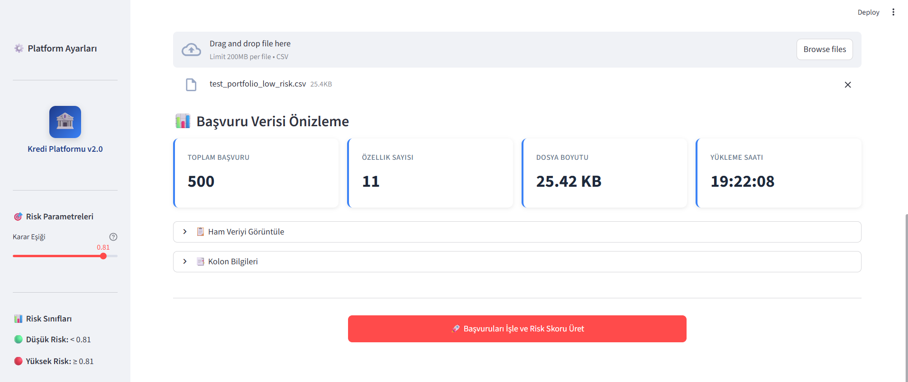
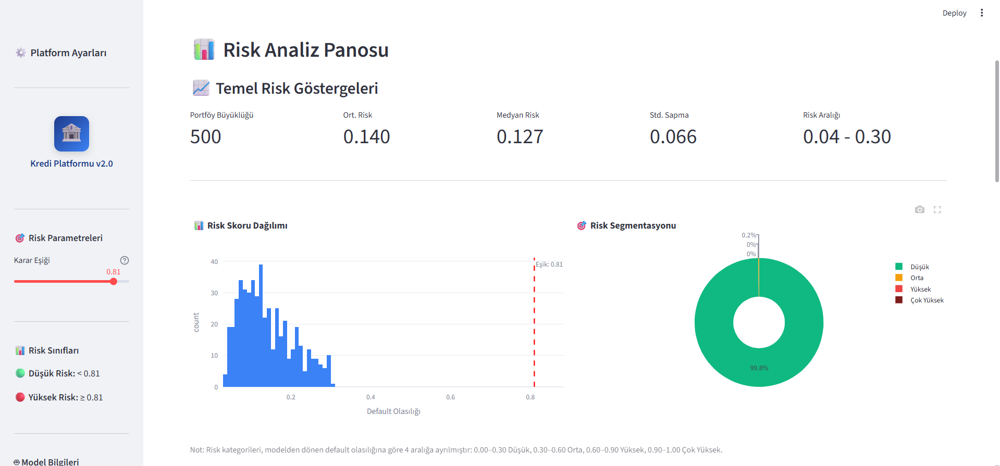
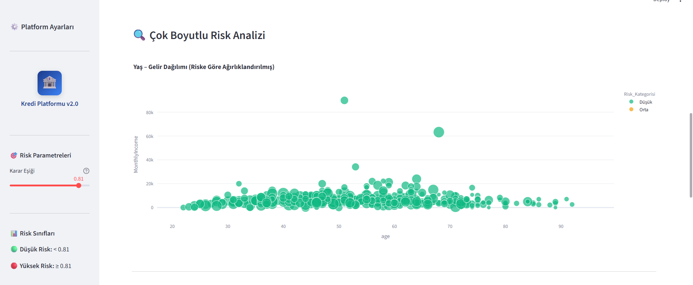
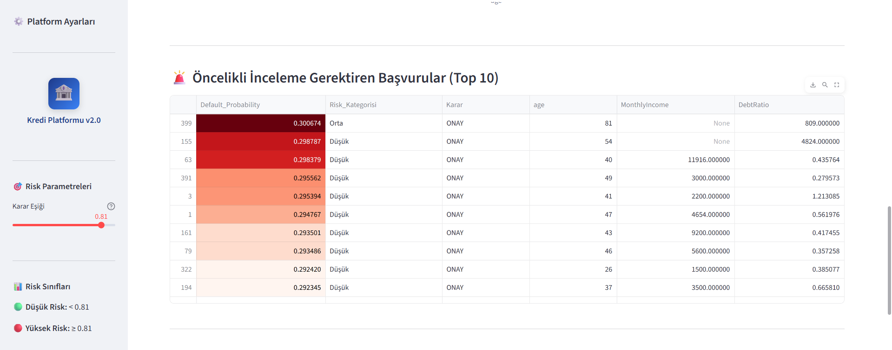
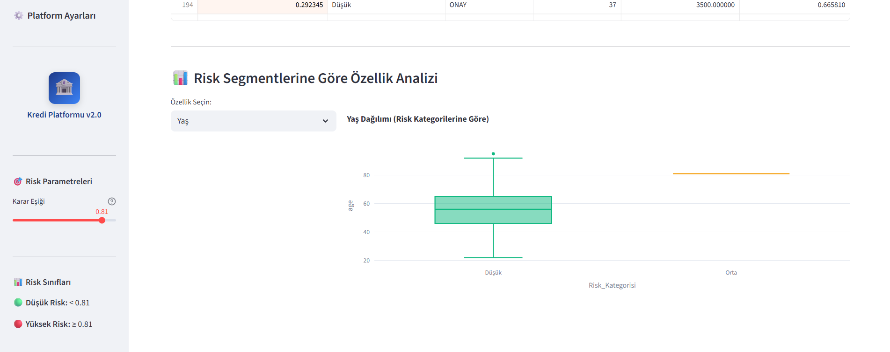
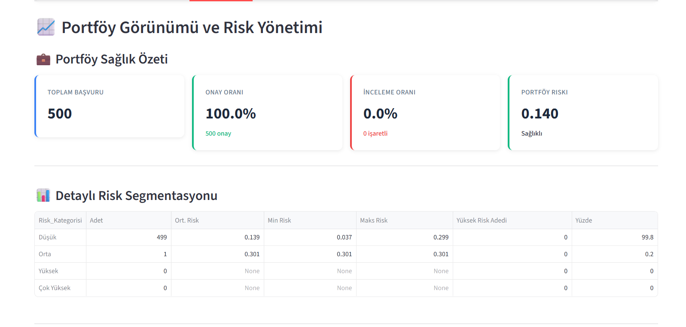
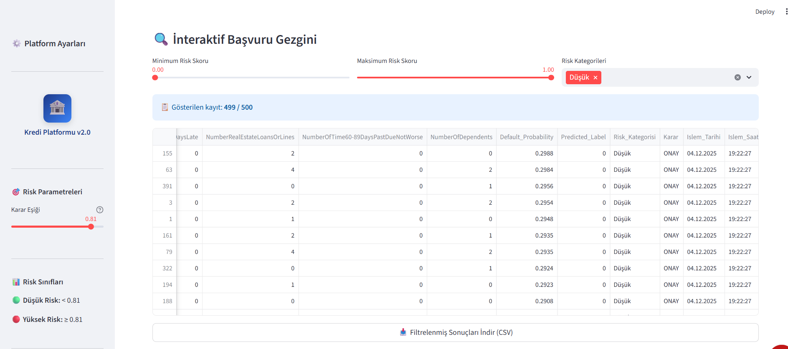

# Senaryo 1 – Low Risk Portföy

Bu senaryoda, model eğitim verisinden türetilmiş **ağırlıklı olarak düşük riskli** 500 başvurudan oluşan bir portföy kullanılmıştır:  
`data/test_portfolio_low_risk.csv`

Bu test dosyası, `tests/generate_test_portfolios.py` ile otomatik olarak üretilmiştir. Amaç, modelin “sağlıklı” bir portföy üzerindeki davranışını ve dashboard bileşenlerini uçtan uca göstermek.

## 1. Başvuru Verisi Yükleme ve Önizleme

- Kullanıcı, `test_portfolio_low_risk.csv` dosyasını yükler.
- Dashboard, dosya hakkında hızlı bir özet gösterir:
  - **Toplam başvuru:** 500  
  - **Özellik sayısı:** 11  
  - **Dosya boyutu:** ~25 KB  
- Bu ekran, portföyün boyut ve şema olarak modele uyumlu olduğunu hızlıca doğrulamak için kullanılır.

## 2. İşleme Özeti ve İlk Risk Dağılımı

- Tüm başvurular başarıyla işlenmiştir.
- Karar eşiği (threshold) **0.81** olarak ayarlıdır.
- Bu senaryoda tüm skorlar düşük olduğu için:
  - **Onaylanan:** 500  
  - **İnceleme gerektiren:** 0  
- Alttaki histogram, skorların 0.30 civarının altında yoğunlaştığını gösterir.

## 3. Risk Analiz Panosu

Bu ekranda portföyün genel risk profili özetlenir:

- **Portföy büyüklüğü:** 500
- **Ortalama risk:** 0.140  
- **Medyan risk:** 0.127  
- **Std. sapma:** 0.066  
- **Risk aralığı:** 0.04 – 0.30  

Sağ taraftaki pasta grafiği, low-risk portföy yapısını net olarak gösterir:

- Başvuruların %99.8’i **“Düşük”** risk segmentindedir.
- Çok az sayıda başvuru “Orta” riske yaklaşsa da, eşik 0.81 olduğu için hepsi **onay** tarafında kalır.

## 4. Çok Boyutlu Risk Analizi

Bu ekran, **yaş–gelir dağılımını** risk skoruna göre görselleştirir:

- Noktaların tamamına yakını yeşil (Düşük risk) olarak işaretlenmiştir.
- Düşük riskli portföylerde bile, farklı yaş ve gelir seviyelerinde başvuruların nasıl kümelendiği görülebilir.
- Bu görünüm, ürün/segment bazlı kredi politikalarını görsel olarak yorumlamak için kullanılabilir.

## 5. Öncelikli İnceleme Tablosu (Top 10)

- Tablo, skor sıralamasına göre en yüksek riskli 10 başvuruyu listeler.
- Bu senaryoda eşik çok yüksek olduğu için **tüm kararlar “ONAY”**, ancak:
- Göreli olarak daha riskli olan satırlar kırmızı tonlarla vurgulanır.
- Operasyon ekibi, isterse düşük risk portföy içinde bile “görece en riskli” başvuruları manuel olarak inceleyebilir.

## 6. Risk Segmentlerine Göre Özellik Analizi

- Örnek olarak **“age”** (yaş) seçildiğinde, yaş dağılımı risk segmentlerine göre kutu grafiği ile gösterilir.
- Low risk senaryoda:
- Düşük risk segmenti geniş bir yaş aralığına yayılmıştır.
- Orta risk segmentinde çok az gözlem vardır ve kutu grafiği oldukça dar görünür.
- Bu ekran, “belirli yaş aralıklarında risk artışı var mı?” gibi sorulara görsel cevap verir.

## 7. Portföy Sağlık Özeti

- **Toplam başvuru:** 500  
- **Onay oranı:** %100  
- **İnceleme oranı:** %0  
- **Portföy riski:** 0.140 (durum: “Sağlıklı”)

Detaylı segmentasyon tablosu:

- 499 başvuru **Düşük** risk kategorisinde.
- 1 başvuru **Orta** risk kategorisine yakın.
- **Yüksek** ve **Çok yüksek** risk segmentlerinde hiç başvuru yok.

Bu tablo, “bu portföyü bankanın hedeflenen risk seviyesi açısından nerede konumlandırıyoruz?” sorusuna doğrudan cevap verir.

## 8. İnteraktif Başvuru Gezgini

- Kullanıcı, **minimum/maksimum risk skoru** ve **risk kategorisi filtreleri** ile kayıtları süzebilir.
- Bu senaryoda filtreler **Düşük** risk için ayarlanmıştır; 499 kayıt görüntülenmektedir.
- Tablo, modelden dönen skorlarla birlikte ham özellik kolonlarını da gösterir.
- Alt kısımdaki buton ile, filtrelenmiş sonuçlar ayrı bir CSV dosyası olarak indirilebilir.

Bu senaryo, modelin **düşük risk yoğunluklu, sağlıklı bir portföy** üzerinde nasıl davrandığını ve dashboard bileşenlerinin uçtan uca nasıl kullanıldığını göstermektedir. Diğer senaryolar (mixed ve stressed), daha dengesiz ve stresli portföylerde bu metriklerin ve görsellerin nasıl değiştiğini karşılaştırmalı olarak incelemek için hazırlanmıştır.
