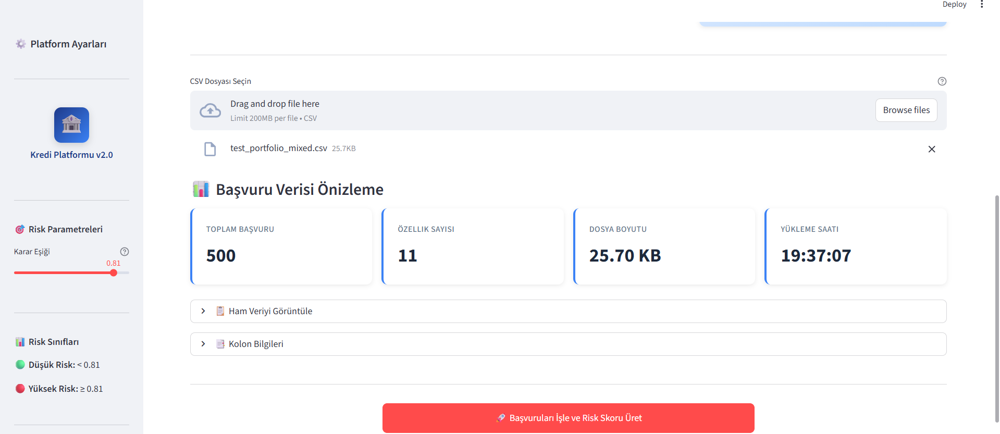
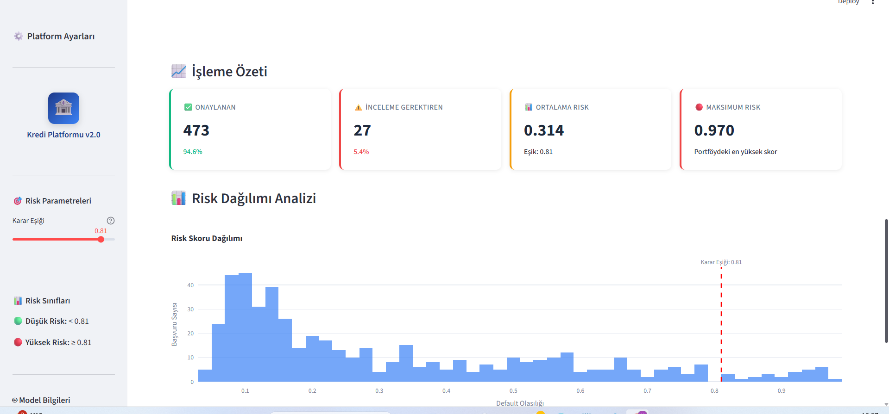
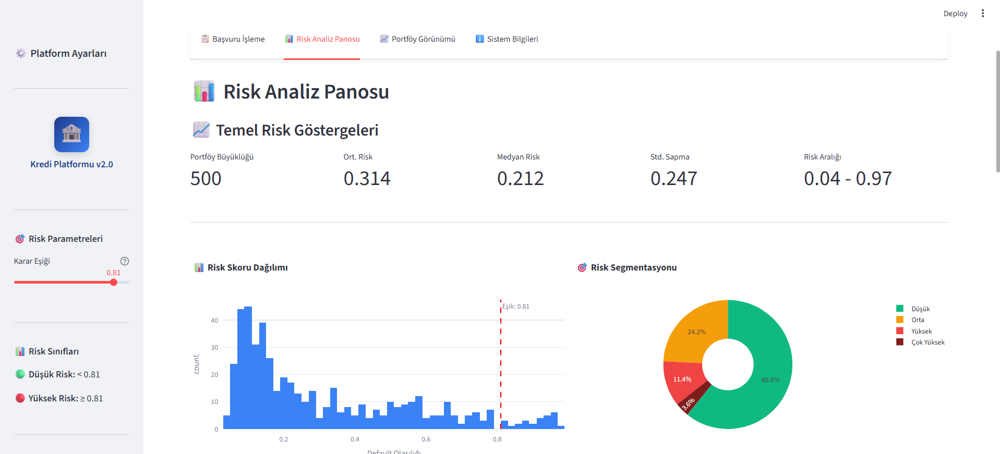
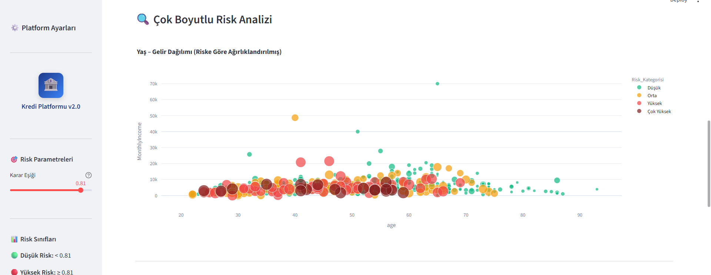
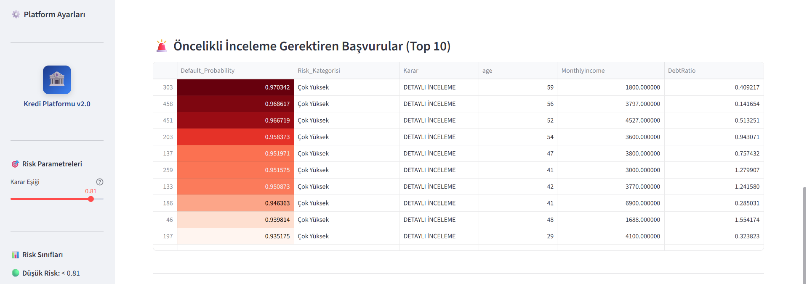
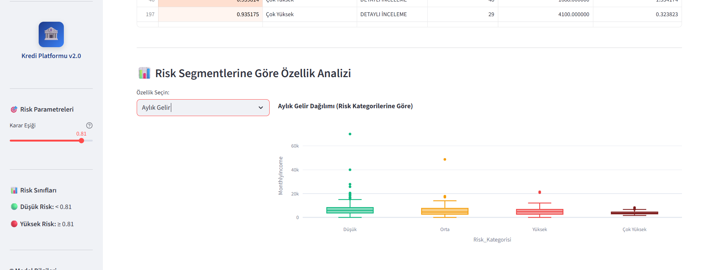
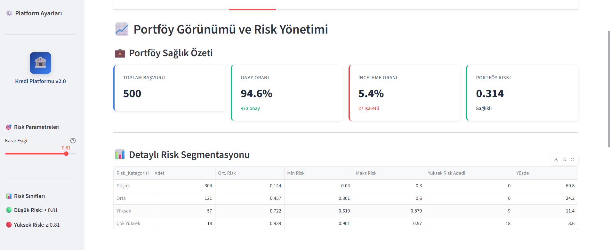
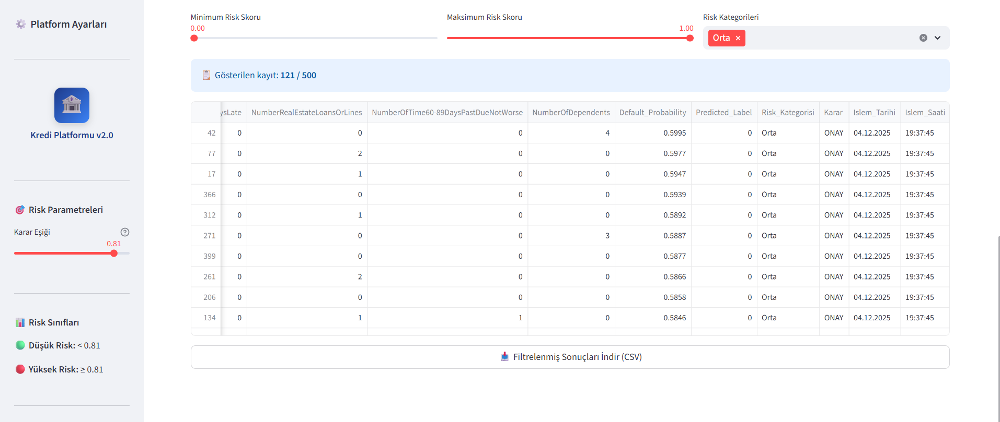

# Mixed Portföy Senaryosu (test_portfolio_mixed.csv)

Bu doküman, **karışık risk profiline sahip** (düşük–orta–yüksek–çok yüksek karışımı) bir portföyde dashboard’un nasıl davrandığını anlatır.  
Kullanılan veri dosyası: `data/test_portfolio_mixed.csv`  
(Not: Bu portföy, `tests/generate_test_portfolios.py ile eğitim verisinden türetilmiştir.)

## 1. Başvuru Verisi Önizleme

- Toplam **500 başvuru** ve **11 özellik** içeren CSV yüklenmiştir.
- Dosya boyutu ve yükleme saati, operasyonel izlenebilirlik için gösterilir.
- Mixed portföy, low senaryosu ile aynı kolon yapısını (schema) kullanır; bu yüzden model için ek bir kolon eşleştirme adımına ihtiyaç    yoktur.

## 2. İşleme Özeti ve Risk Dağılımı

- **Onaylanan başvuru:** 473 (**%94.6**)  
- **İnceleme gerektiren:** 27 (**%5.4**)  
- **Ortalama risk:** 0.314, **maksimum risk:** 0.97 (low senaryoya göre belirgin şekilde daha yüksek).
- Histogramda skor dağılımı 0.8 üzerinde uzayan bir kuyruk oluşturarak yüksek riskli başvuruların varlığını gösteriyor.

## 3. Risk Analiz Panosu – Segmentasyon

- Portföy boyutu yine **500**, fakat risk dağılımı artık karışık:
  - **Düşük:** %60.8  
  - **Orta:** %24.2  
  - **Yüksek:** %11.4  
  - **Çok Yüksek:** %3.6
- Risk aralığı **0.04 – 0.97**, standart sapma **0.247**: skorların portföy içinde daha yaygın bir spektruma dağıldığını gösteriyor.
- Bu görünüm, modelin tek bir sınıfa yığılmadığını ve **ayrıştırıcı** çalıştığını görsel olarak doğruluyor.

## 4. Çok Boyutlu Risk Analizi – Yaş & Gelir

- Noktalar başvuruları, renkler ise risk kategorilerini gösterir.
- Low senaryoya kıyasla turuncu/kırmızı/kahverengi noktalar belirgin biçimde artmış durumda.
- Özellikle **daha düşük gelir–orta yaş** bandında yoğunlaşan yüksek risk kümeleri, kredi politikaları için uyarı bölgesi gibi okunabilir.

## 5. Öncelikli İnceleme Gerektiren Başvurular (Top 10)

- Tablo, **en yüksek skorlu 10 başvuruyu** ısı haritası tonlarıyla gösteriyor.
- Bu başvuruların tamamı **“Çok Yüksek”** risk kategorisinde ve karar kolonu **“Detaylı İnceleme”** olarak işaretlenmiş durumda.
- Ekip bu tabloyu kullanarak, **risk iştahını en çok zorlayan** başvuruları tek tıkla inceleyebiliyor.

## 6. Risk Segmentlerine Göre Aylık Gelir Dağılımı

- Boxplot, x ekseninde **Risk_Kategorisi**, y ekseninde **MonthlyIncome** kullanır.
- **Düşük risk** segmentinde gelir dağılımı görece daha geniş ve üst çeyrek daha yüksek;  
  **Yüksek/Çok Yüksek** segmentlerde ise medyan gelirin aşağıya kaydığı görülür.
- Bu, modelin **gelir seviyesi düştükçe risk skorunu artıran bir davranış** sergilediğini görselleştirir (diğer değişkenlerle birlikte).

## 7. Portföy Görünümü ve Risk Yönetimi

- Portföy sağlık kartı:
  - **Onay oranı:** %94.6  
  - **İnceleme oranı:** %5.4  
  - **Portföy riski:** 0.314 – hâlâ “Sağlıklı” bandında, fakat low senaryoya göre belirgin şekilde daha yüksek.
- Detaylı segmentasyon tablosu:
  - Satır bazında her risk kategorisi için **adet, ortalama risk, min–maks risk, yüksek risk adedi, yüzde payı** gösterilir.
  - Bu tablo, **hangi segmentte “yoğunlaşma” olduğunu** net biçimde ortaya koyar (örn. orta & yüksek segmentlerin toplamı ≈ %35).

## 8. İnteraktif Başvuru Gezgini – Orta Risk Filtresi

- Bu ekran, sadece **“Orta” risk kategorisindeki** başvuruları filtreleyerek listeler.
- Risk skoru slider’ı ve kategori filtresi sayesinde ekip:
  - **Belirli skor aralığını** (örneğin 0.5–0.7,
    gri bölge) izole edebilir,
  - Gerekirse bu segment için ek iş kuralları (ek belge isteği, manuel onay vb.) tanımlayabilir.
- CSV indirme butonu, filtrelenmiş sonuçların **offline analiz veya raporlama** için dışa aktarılmasını sağlar.

Bu mixed senaryo ile dashboard’un:

- Tek tip sağlıklı portföylerde **“her şey yolunda”** sinyalini verebildiğini,
- Aynı zamanda **karma risk profiline sahip, gerçek hayata daha yakın** bir portföyde de  
  **hangi segmentlerin dikkat gerektirdiğini katman katman gösterebildiğini**

görsel olarak belgeledik.
