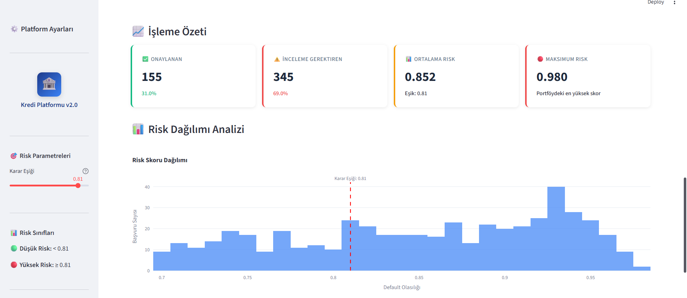
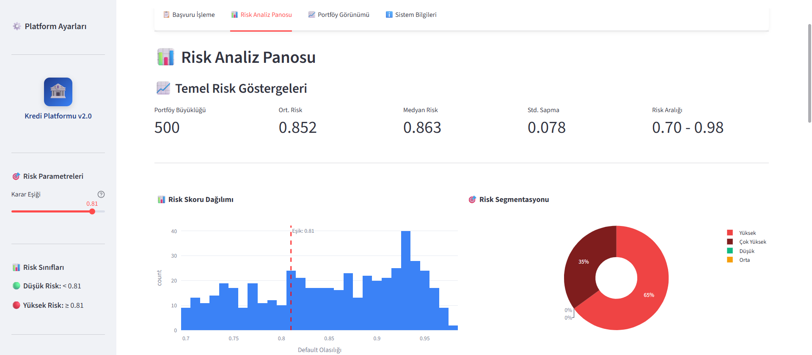
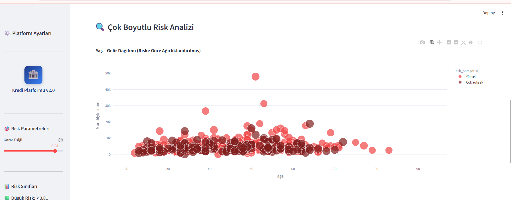
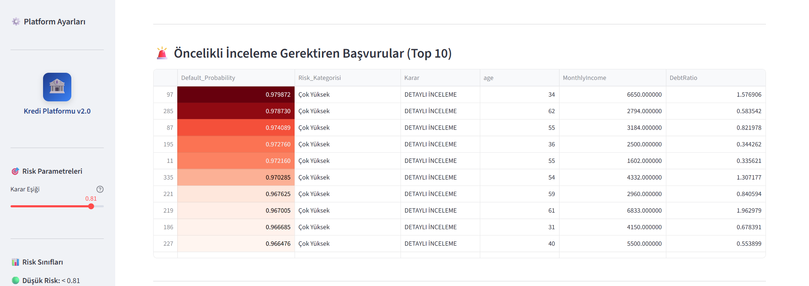
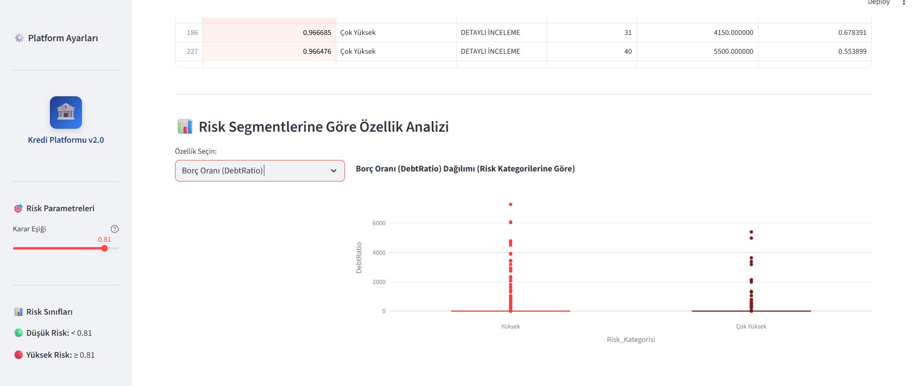
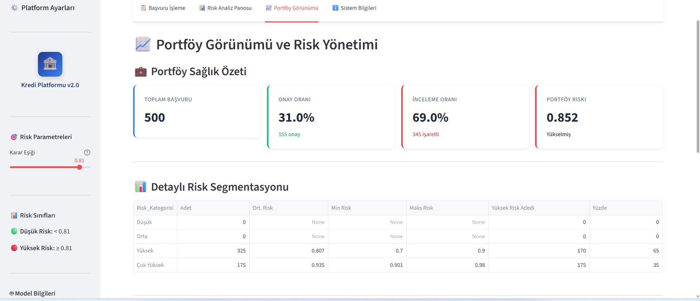
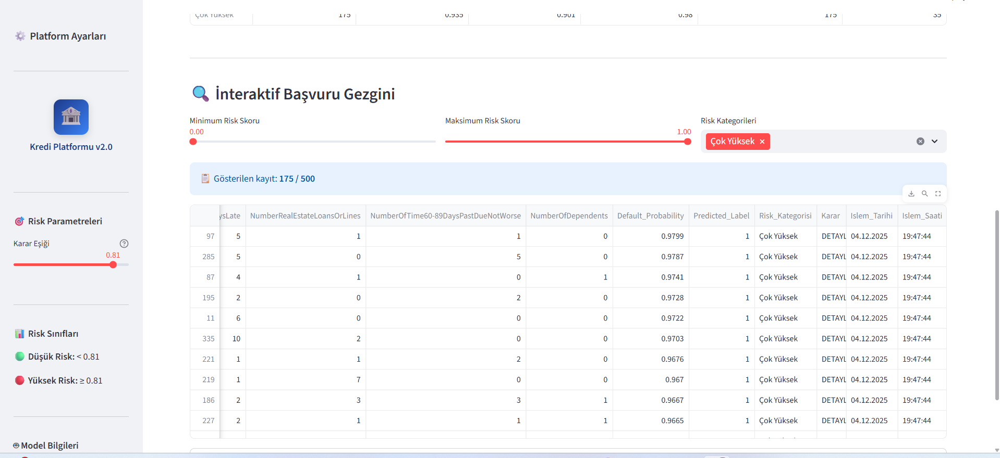

# Stress Portföyü Analizi

Bu senaryo, yüksek riskli başvuruların ağırlıkta olduğu stres testine dayanmaktadır.  
Modelin aşırı risk yükü altındaki davranışı, karar eşiği değişmeden (0.81) gözlemlenmiştir.

## 1. Veri Yükleme ve Özet Görünüm

- **Toplam başvuru:** 500  
- **Özellik sayısı:** 11  
- **Yükleme saati:** 19:47:35  
- Dosya boyutu küçük olmasına rağmen yüksek risk yoğunluğu dikkat çekicidir.

## 2. İşleme Özeti ve Risk Dağılımı

- **Onaylanan:** 155 (%31)  
- **İnceleme Gerektiren:** 345 (%69)  
- **Ortalama Risk:** 0.852  
- **Maksimum Risk:** 0.980  
- Histogramın büyük bölümü eşik üzerinde yoğunlaşmıştır.

## 3. Risk Analiz Panosu

- Ortalama risk 0.852, medyan 0.863’tür.  
- Risk aralığı 0.70–0.98; varyans düşüktür çünkü portföy neredeyse tamamen yüksek risklilerden oluşur.  
- Sağdaki **pasta grafiğinde**, yüksek (65%) ve çok yüksek (35%) segmentlerin toplamı portföyün %100’ünü oluşturur.

## 4. Çok Boyutlu Risk Analizi

- **Balon grafiği (bubble chart)** yaş–gelir ekseninde yoğunlaşmayı gösterir.  
- Neredeyse tüm başvurular kırmızı ve koyu tonlardadır → “Yüksek” ve “Çok Yüksek” risk grupları.  
- Yüksek gelir–yüksek yaş grubunda bile riskin düşmemesi, stres senaryosunun ciddiyetini gösterir.

## 5. Öncelikli İnceleme Gerektirenler

- En yüksek **default olasılıkları (%96–98)** burada toplanmıştır.  
- Karar sütununda tümü *Detaylı İnceleme* olarak işaretlenmiştir.  
- Bu tablo, modelin doğru şekilde “aşırı riskli” gözlemleri yakalayabildiğini gösterir.

## 6. Özellik Analizi (Borç Oranı – DebtRatio)

- Bu senaryoda kutu grafiği için **“Borç Oranı (DebtRatio)”** seçilmiştir.  
- “Çok Yüksek” segmentteki borç oranlarının hem ortalaması hem de varyansı belirgin biçimde fazladır.  
- Bu, yüksek riskli bireylerin **borç yükü** baskın bir faktör olduğunu destekler.

## 7. Portföy Görünümü ve Risk Yönetimi

- **Onay oranı:** %31  
- **İnceleme oranı:** %69  
- **Portföy riski:** 0.852  
- Tüm segmentler “Yüksek” ve “Çok Yüksek” olarak sınıflandırılmıştır — *Düşük* veya *Orta* segment yoktur.

## 8. İnteraktif Başvuru Gezgini

- Filtre: `Risk Kategorisi = Çok Yüksek`  
- Görülen kayıt sayısı: 175 / 500  
- Bu tablo, model çıktılarının **portföy düzeyinde filtrelenebilir** olduğunu gösterir.

## Genel Değerlendirme

Bu stres senaryosu, modelin **yüksek riskli portföylerde dahi tutarlı karar üretebildiğini** göstermektedir.  
Karar eşiği sabit kalmasına rağmen:  
- İnceleme oranı belirgin biçimde artmıştır,  
- Ortalama risk 0.85 seviyesinde sabitlenmiştir,  
- Model, borç oranı yüksek başvuruları doğru biçimde *inceleme listesine* almıştır.

Bu analiz, dashboard’un stres testlerine uygun esnekliğini ve modelin aşırı durumlarda bile karar tutarlılığını vurgular.
