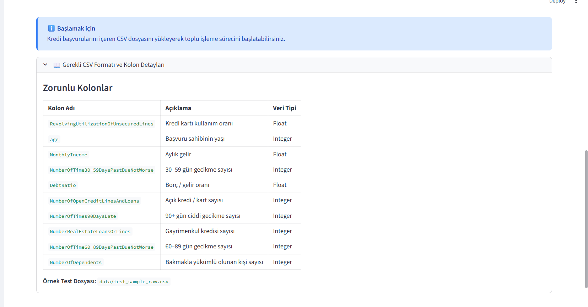

# Dashboard Kullanım Rehberi

Bu doküman, **Kredi Risk Değerlendirme Platformu** arayüzünün genel yapısını ve temel bileşenlerini kısaca özetler. Detaylı senaryo bazlı analizler, ayrı case dokümanlarında ele alınmaktadır.

## 1. Ana Sayfa ve Genel Yerleşim

Yukarıdaki ekran görüntüsü, platformun açılış görünümünü göstermektedir.

### 1.1. Üst Banner

- **Başlık:** `Kredi Risk Değerlendirme Platformu`
- **Alt metin:** “Gerçek zamanlı, makine öğrenmesi tabanlı kredi risk değerlendirme ve karar destek sistemi”
- Bu alan, projenin kurumsal mesajını ve amacını özetler.

### 1.2. Ana Sekmeler

Üst bölümde dört ana sekme yer alır:

1. **📋 Başvuru İşleme**  
   – CSV yükleme  
   – Başvuruların tek seferde işlenmesi  
   – Onay / inceleme ayrımı ve özet metrikler  

2. **📊 Risk Analiz Panosu**  
   – Risk skoru dağılımı histogramı  
   – Risk segmentasyonu (Düşük / Orta / Yüksek / Çok Yüksek)  
   – Yaş–gelir gibi çok boyutlu görselleştirmeler  

3. **📈 Portföy Görünümü**  
   – Onay / inceleme oranları  
   – Portföy genel risk seviyesi  
   – İnteraktif filtreler ile başvuru detaylarını gezebilme  

4. **ℹ️ Sistem Bilgileri**  
   – Model mimarisi  
   – Performans metrikleri  
   – Platform yetkinlikleri ve dokümantasyon linkleri  

### 1.3. Sol Sidebar

- **Karar Eşiği** slider’ı: Binary sınıflandırma için kullanılan `threshold` değeri.
- **Risk Sınıfları:**  
  – Düşük risk: threshold altındaki başvurular  
  – Yüksek risk: threshold üzerindeki başvurular  
- **Model Bilgileri:** Algoritma ve temel metriklerin özetlenmiş hâli (ROC-AUC, Precision, Recall, F1, optimal eşik).

## 2. Başvuru İşleme Sekmesi

Bu sekme, **CSV formatı**, **zorunlu kolonlar** ve **örnek test dosyası** hakkında bilgi verir.

### 2.1. Desteklenen Format Kutusu

- Dosya tipi: **CSV**
- Format: Model eğitiminde kullanılan örnek veri setiyle uyumlu şema
- Boyut: Maksimum 200 MB
- Kolon sayısı: 10–11 özellik

Bu bölüm, teknik detaya girmeden “hangi dosyayı yüklersem sistem çalışır?” sorusuna cevap verir.

### 2.2. Zorunlu Kolonlar Tablosu

Tabloda her kolon için:

- **Kolon Adı**
- **Açıklama** (iş anlamı)
- **Veri Tipi**

bilgileri verilmiştir. Bu tablo, veri ekibi için şemayı hızlıca anlayabilecekleri, “hafif bir data dictionary” görevi görür.

## 3. Detaylı Senaryo İncelemeleri

Dashboard’un davranışını daha iyi göstermek için, aynı modeli üç farklı portföy tipi üzerinde test ediyoruz:

1. **Low Risk Portföy (`data/test_portfolio_low_risk.csv`)**  
   – Ağırlıklı olarak düşük riskli başvurulardan oluşan, görece “sağlıklı” bir portföy.

2. **Mixed Portföy (`data/test_portfolio_mixed.csv`)**  
   – Gerçek hayata daha yakın, düşük–orta–yüksek risk karışımı içeren portföy.

3. **Stressed Portföy (`data/test_portfolio_stressed.csv`)**  
   – Çoğunlukla yüksek riskli başvurulardan oluşan, stres senaryosu portföyü.

> Bu üç portföy, projedeki `tests/generate_test_portfolios.py` kullanılarak  
> eğitim verisi üzerinden **modelin ürettiği risk skorlarına göre otomatik** oluşturulmuştur.  
> Böylece, elle seçilmemiş ama gerçekçi dağılımlara sahip test senaryoları elde edilir.

Her senaryo için ayrı dokümanlarda:

- Risk Analiz Panosu’ndaki histogram ve segment dağılımları  
- Portföy Görünümü’ndeki onay / inceleme oranları  
- Kısa iş yorumları

paylaşılmaktadır:

- [`docs/cases/low/low.md`](cases/low/low.md) – Low risk senaryo  
- [`docs/cases/mixed/mixed.md`](cases/mixed/mixed.md) – Mixed portföy senaryosu  
- [`docs/cases/stress/stress.md`](cases/stress/stress.md) – Stressed portföy senaryosu  

Bu sayede, dashboard’un sadece statik bir arayüz olmadığını, **farklı portföy tiplerine nasıl tepki verdiğini** de net bir şekilde gösterebiliyoruz.

Bu rehber sayesinde:

- Streamlit koduna bakmadan,
- Sadece birkaç ekran görüntüsü üzerinden

**“Bu dashboard ne yapıyor, nereden neye bakıyoruz?”** sorusunun cevabını hızlıca verebilmek hedeflenmiştir.
